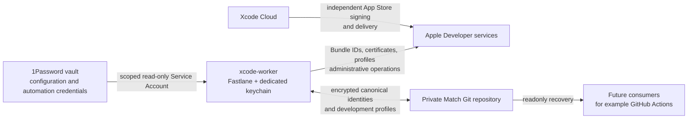

# xcode-worker-bootstrap

 [](LICENSE)

Reproducible headless macOS/Xcode worker with Fastlane Match, 1Password-backed secrets, Developer ID signing, Tailscale, and clean-Mac recovery.

A dedicated Xcode Mac is easy to configure by hand and hard to rebuild after loss: signing keys, profiles, login keychains, remote access, and certificate expiry become implicit machine state. This reference project makes those dependencies documented and bootstrapable. It has been validated on a real Apple Silicon worker, including cold reboot without GUI login and readonly signing recovery.

## Architecture



The **public repository** holds bootstrap and verification code. The **private Match repository** holds encrypted self-managed signing assets. The worker imports those assets into its dedicated runtime keychain. Xcode Cloud can own App Store production signing and delivery independently.

## What it provides

| Capability | How this reference handles it |
| --- | --- |
| Rebuild a worker | Homebrew tooling, system `tailscaled`, power settings, signing keychain, and Time Machine exclusions are bootstrapable. |
| Work without GUI login | SSH/Tailscale and the caffeinate LaunchDaemon survive a cold reboot. |
| Recover signing | Readonly Match lanes restore Apple Development profiles and Developer ID Application/Installer identities. |
| Administer signing | Declarative Bundle IDs, explicit write lanes, Account Holder provisioning, and partial-failure recovery. |
| Detect expiry | `fastlane signing_status` reads canonical Match certificates; warnings start at 90 days and critical status at 30 days. |

## Trust and secret boundaries

The only persistent **local Apple bootstrap credential** is a scoped 1Password Service Account token at `~/.config/xcode-worker/1password-service-account-token`. The worker also retains imported signing identities in `~/Library/Keychains/xcode-worker.keychain-db`; those are runtime copies, while the encrypted private Match repository is canonical. The worker needs separate Git access to that private repository.

| Location | Responsibility |
| --- | --- |
| 1Password | ASC API key, Team ID, private Match URL and encryption password, dedicated keychain password, development Bundle ID inventory. |
| Private Match Git repository | Canonical Apple Development, Developer ID Application, and Developer ID Installer identities; development provisioning profiles. |
| Worker keychain | Runtime identities recovered from Match. |
| Account Holder | Interactive Apple ID password/2FA only for exceptional Developer ID provisioning; this repository does not persist them. |

Normal signing consumers use **readonly Match**. No persistent ASC `.p8` file is created: the private key is read from 1Password and reconstructed in memory. See [Security](#security-and-license) and [SECURITY.md](SECURITY.md).

### 1Password schema

Create these items and fields in the `automation-apple` vault:

```text
automation-apple/
├── app-store-connect
│   ├── key_id
│   ├── issuer_id
│   ├── team_id
│   └── private_key
├── fastlane-match
│   ├── password
│   └── repository
├── xcode-worker-keychain
│   └── password
└── development-apps
    └── bundle_ids
```

Use `XCODE_WORKER_OP_VAULT` for another vault name. `bundle_ids` is one Bundle ID per line (for example, `com.example.MyApp`). `private_key` is the **one-line base64 body** of an ASC `.p8` EC private key, without PEM markers. `repository` is a private SSH Git URL or HTTPS Git URL without embedded credentials. The [configuration guide](docs/configuration.md#1password-access-and-configuration) covers each field.

## Quick start

### Prerequisites

- Apple Silicon Mac with a compatible macOS and Xcode installation, plus the required iOS Simulator runtime. The tested reference used macOS 27.0 and Xcode 27.0; the scripts do not pin those versions.
- Apple Developer Program team and ASC API key; an Account Holder is needed only for exceptional Developer ID provisioning.
- Homebrew installed at `/opt/homebrew`, a 1Password vault and scoped **read-only** Service Account, and Git access to your **private** Match repository.
- Tailscale account for the documented remote-access setup. Configure Remote Login and Screen Sharing in macOS. A Time Machine destination is optional.

### Bootstrap and restore

1. Create the worker account (default `worker`), install Xcode and Homebrew, and [prepare macOS](docs/setup.md#prepare-macos). Create the 1Password schema above and grant the worker Git access to your private Match repository.
2. Clone and enter this public repository:

   ```bash
   git clone https://github.com/0k-lab/xcode-worker-bootstrap.git ~/Developer/xcode-worker-bootstrap
   cd ~/Developer/xcode-worker-bootstrap
   ```

3. Obtain the scoped Service Account token from your 1Password administrator. Review and run the bootstrap script; it prompts privately for the token if no token file or `OP_SERVICE_ACCOUNT_TOKEN` is present:

   ```bash
   ./bootstrap.sh
   ```

4. Finish [remote access](docs/setup.md#configure-remote-access), [Tailscale](docs/setup.md#configure-tailscale), Git, and optional Time Machine setup. Authenticate Tailscale and Codex separately.
5. Recover the canonical signing material **readonly**, then verify:

   ```bash
   fastlane sync_development_signing_readonly
   fastlane sync_developer_id_application_readonly
   fastlane sync_developer_id_installer_readonly
   ./verify.sh
   ```

   The Developer ID readonly lanes require their identities to have been provisioned in Match already. On a new setup without them, use the [explicit administrative flow](docs/developer-id.md#developer-id-canonical-assets) when needed. `./verify.sh` checks the configured worker, not just repository syntax; see [verification](docs/recovery.md#verification).

The defaults are user `worker`, host `xcode-worker`, and vault `automation-apple`. Set `XCODE_WORKER_USER`, `XCODE_WORKER_HOSTNAME`, and `XCODE_WORKER_OP_VAULT` as appropriate. The keychain and token path retain the `xcode-worker` name. No source edit is needed for your Team ID, Match URL, or Bundle IDs.

## Common commands

Run Fastlane commands from the repository root. **Readonly** means no Apple Developer or canonical Match write; some lanes unlock or import identities into the *local* dedicated keychain.

| Normal or readonly command | Effect |
| --- | --- |
| `fastlane signing_status` | Reads encrypted canonical Match certificates and reports expiry. |
| `fastlane list_development_apps` | Reads and validates the 1Password Bundle ID inventory. |
| `fastlane preflight_developer_id_keychain` | Local-only import/signing probe; normalizes the user keychain search list and creates/removes a temporary test identity. |
| `fastlane sync_development_signing_readonly` | Restores Apple Development identity and declared profiles from Match. Accepts optional `certificate_id:<id>`. |
| `fastlane sync_developer_id_application_readonly` | Restores and validates the Application identity from Match. |
| `fastlane sync_developer_id_installer_readonly` | Restores and validates the Installer identity, including disposable package signing. |
| `./verify.sh` | Checks worker configuration; exits nonzero on failures. |

| Administrative command | Possible write |
| --- | --- |
| `fastlane bootstrap_app bundle_id:com.example.NewApp` | May create the Apple Bundle ID, development identity/profile, and Match assets. The ID must first be in 1Password. |
| `fastlane sync_development_signing` | May create an Apple Development identity/profile and write Match. |
| `fastlane reconcile_development_profiles certificate_id:<existing-id>` | Forces profile regeneration for all declared IDs and writes Apple/Match state. |
| `fastlane provision_developer_id_signing` | Interactive Account Holder flow; may issue missing Developer ID certificates and write Match. |
| `fastlane recover_developer_id_signing type:developer_id certificate_id:<existing-id> recovery_path:<absolute-path>` | Imports an already issued Application pair into Match; use `type:developer_id_installer` for Installer. Does not request a new Apple certificate. |

These write lanes are **manual administration**, never worker startup steps. The [signing administration guide](docs/signing.md#signing-administration) explains certificate selection, rotation, and failure handling.

## Signing lifecycle and recovery

**Apple Development** uses ASC API operations where supported. The 1Password Bundle ID inventory drives profile reconciliation, and the certificate, private key, and profiles live canonically in Match. **Developer ID Application** signs macOS apps distributed outside the App Store. **Developer ID Installer** signs packages; its validation uses actual `productsign` and `pkgutil --check-signature`, plus certificate/key and chain checks. `signing_status` reads canonical Match state, with warning at 90 days and critical at 30 days before expiry.

If the worker dies, install macOS/Xcode/Homebrew on a new Mac, clone this repository, supply a replacement or recovered scoped Service Account token, run `./bootstrap.sh`, restore from Match through the readonly lanes, and run `./verify.sh`. Re-enable SSH/Tailscale and test a cold reboot without GUI login. Operators do not need to find old `.p12` or `.p8` files; the canonical `.p12` material is encrypted in private Match, and the ASC key body is in 1Password. See the [full recovery checklist](docs/recovery.md#clean-mac-checklist).

If Apple has issued a Developer ID certificate but a later validation or Match import fails, the provisioning lane leaves a private `~/.config/xcode-worker/developer-id-recovery-*` directory containing the issued certificate, CSR, and key. **Do not request another certificate immediately.** Diagnose the error and use `recover_developer_id_signing` with the existing certificate ID and absolute directory path. It validates the pair, imports it into Match, validates readonly recovery, then removes the directory. Treat any retained directory as sensitive key material; the pattern is Git-ignored. See [Developer ID canonical assets](docs/developer-id.md#developer-id-canonical-assets).

Xcode Cloud can independently manage App Store distribution certificates, production profiles, and TestFlight/App Store delivery. This repository owns self-managed development and Developer ID signing; keeping those roles separate avoids duplicating production distribution assets.

## Scope

This is a concrete worker reference, not generic fleet management or arbitrary CI orchestration. It does not own App Store production delivery, replace Xcode Cloud, publish the private Match repository, or automate Account Holder password/2FA. GitHub Actions or other consumers may later use the canonical signing material **readonly**.

## Documentation and repository map

- [Clean Mac setup](docs/setup.md): macOS, Xcode, bootstrap, remote access, Tailscale, power, and Time Machine.
- [Configuration](docs/configuration.md): 1Password fields, Service Account, Match environment, and keychain.
- [Apple Development signing](docs/signing.md): profiles, canonical Match state, status, and rotation.
- [Developer ID signing](docs/developer-id.md): Application and Installer provisioning, validation, failure recovery, and rotation.
- [Operations](docs/operations.md): exact readonly and administrative commands.
- [Lost worker recovery](docs/recovery.md): clean Mac checklist, verification, and backup requirements.

The main implementation files are:

```text
.
├── bootstrap.sh                 # Host setup; run explicitly on a new worker
├── verify.sh                    # Worker acceptance checks
├── Brewfile                     # Homebrew and npm tooling
├── fastlane/
│   ├── Fastfile                 # Readonly and administrative signing lanes
│   └── Matchfile                # Git storage, readonly by default
├── launchd/
│   └── local.xcode-worker.caffeinate.plist
└── SECURITY.md                  # Private vulnerability reporting guidance
```

## Security and license

Treat coding agents and automation jobs as code running with the privileges of the worker account. Never commit a 1Password Service Account token, ASC private key, Match encryption password, or recovered certificate/private key. Keep the Match repository private and scope the Service Account to read-only access to only the automation vault. Account Holder login is exceptional interactive administrative access, not a worker credential. Recovery directories contain sensitive key material even though they are Git-ignored.

The dedicated keychain and Service Account token are high-value credentials. If a worker is compromised, revoke its Service Account token, issue a replacement, and rotate or revoke exposed credentials. Removing a secret from HEAD does not remove it from Git history. Keep unrelated personal or production credentials off this worker. See [SECURITY.md](SECURITY.md) for private vulnerability reporting and the [MIT License](LICENSE) for licensing.
