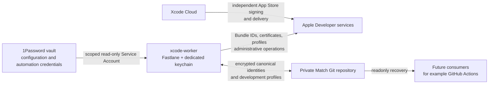

# xcode-worker-bootstrap

 [](LICENSE)

Reproducible headless macOS/Xcode worker with Fastlane Match, 1Password-backed secrets, Developer ID signing, Tailscale, and clean-Mac recovery.

A dedicated Xcode Mac is easy to configure by hand and hard to rebuild after loss: signing keys, profiles, login keychains, remote access, and certificate expiry become implicit machine state. This reference project makes those dependencies documented and bootstrapable. It has been validated on a real Apple Silicon worker, including cold reboot without GUI login and readonly signing recovery.

## Architecture



The **public repository** holds bootstrap and verification code. The **private Match repository** holds encrypted self-managed signing assets. The worker imports those assets into its dedicated runtime keychain. Xcode Cloud can own App Store production signing and delivery independently.

## What it provides

| Capability | How this reference handles it |
| --- | --- |
| Rebuild a worker | Homebrew tooling, system `tailscaled`, power settings, signing keychain, and Time Machine exclusions are bootstrapable. |
| Work without GUI login | SSH/Tailscale and the caffeinate LaunchDaemon survive a cold reboot. |
| Recover signing | Readonly Match lanes restore Apple Development profiles and Developer ID Application/Installer identities. |
| Administer signing | Declarative Bundle IDs, explicit write lanes, Account Holder provisioning, and partial-failure recovery. |
| Detect expiry | `fastlane signing_status` reads canonical Match certificates; warnings start at 90 days and critical status at 30 days. |

## Trust and secret boundaries

The only persistent **local Apple bootstrap credential** is a scoped 1Password Service Account token at `~/.config/xcode-worker/1password-service-account-token`. The worker also retains imported signing identities in `~/Library/Keychains/xcode-worker.keychain-db`; those are runtime copies, while the encrypted private Match repository is canonical. The worker needs separate Git access to that private repository.

| Location | Responsibility |
| --- | --- |
| 1Password | ASC API key, Team ID, private Match URL and encryption password, dedicated keychain password, development Bundle ID inventory. |
| Private Match Git repository | Canonical Apple Development, Developer ID Application, and Developer ID Installer identities; development provisioning profiles. |
| Worker keychain | Runtime identities recovered from Match. |
| Account Holder | Interactive Apple ID password/2FA only for exceptional Developer ID provisioning; this repository does not persist them. |

Normal signing consumers use **readonly Match**. No persistent ASC `.p8` file is created: the private key is read from 1Password and reconstructed in memory. See [Security](#security) and [SECURITY.md](SECURITY.md).

### 1Password schema

Create these items and fields in the `automation-apple` vault:

```text
automation-apple/
├── app-store-connect
│   ├── key_id
│   ├── issuer_id
│   ├── team_id
│   └── private_key
├── fastlane-match
│   ├── password
│   └── repository
├── xcode-worker-keychain
│   └── password
└── development-apps
    └── bundle_ids
```

Use `XCODE_WORKER_OP_VAULT` for another vault name. `bundle_ids` is one Bundle ID per line (for example, `com.example.MyApp`). `private_key` is the **one-line base64 body** of an ASC `.p8` EC private key, without PEM markers. `repository` is a private SSH Git URL or HTTPS Git URL without embedded credentials. The [configuration guide](#1password-access-and-configuration) covers each field.

## Quick start

### Prerequisites

- Apple Silicon Mac with a compatible macOS and Xcode installation, plus the required iOS Simulator runtime. The tested reference used macOS 27.0 and Xcode 27.0; the scripts do not pin those versions.
- Apple Developer Program team and ASC API key; an Account Holder is needed only for exceptional Developer ID provisioning.
- Homebrew installed at `/opt/homebrew`, a 1Password vault and scoped **read-only** Service Account, and Git access to your **private** Match repository.
- Tailscale account for the documented remote-access setup. Configure Remote Login and Screen Sharing in macOS. A Time Machine destination is optional.

### Bootstrap and restore

1. Create the worker account (default `worker`), install Xcode and Homebrew, and [prepare macOS](#prepare-macos). Create the 1Password schema above and grant the worker Git access to your private Match repository.
2. Clone and enter this public repository:

   ```bash
   git clone https://github.com/0k-lab/xcode-worker-bootstrap.git ~/Developer/xcode-worker-bootstrap
   cd ~/Developer/xcode-worker-bootstrap
   ```

3. Obtain the scoped Service Account token from your 1Password administrator. Review and run the bootstrap script; it prompts privately for the token if no token file or `OP_SERVICE_ACCOUNT_TOKEN` is present:

   ```bash
   ./bootstrap.sh
   ```

4. Finish the [manual Xcode](#install-xcode), [remote access](#configure-remote-access), [Tailscale](#configure-tailscale), Git, and optional Time Machine steps. Authenticate Tailscale and Codex separately.
5. Recover the canonical signing material **readonly**, then verify:

   ```bash
   fastlane sync_development_signing_readonly
   fastlane sync_developer_id_application_readonly
   fastlane sync_developer_id_installer_readonly
   ./verify.sh
   ```

   The Developer ID readonly lanes require their identities to have been provisioned in Match already. On a new setup without them, use the [explicit administrative flow](#developer-id-canonical-assets) when needed. `./verify.sh` checks the configured worker, not just repository syntax; see [verification](#verification).

The defaults are user `worker`, host `xcode-worker`, and vault `automation-apple`. Set `XCODE_WORKER_USER`, `XCODE_WORKER_HOSTNAME`, and `XCODE_WORKER_OP_VAULT` as appropriate. The keychain and token path retain the `xcode-worker` name. No source edit is needed for your Team ID, Match URL, or Bundle IDs.

## Command guide

Run Fastlane commands from the repository root. **Readonly** means no Apple Developer or canonical Match write; some lanes unlock or import identities into the *local* dedicated keychain.

| Normal or readonly command | Effect |
| --- | --- |
| `fastlane signing_status` | Reads encrypted canonical Match certificates and reports expiry. |
| `fastlane list_development_apps` | Reads and validates the 1Password Bundle ID inventory. |
| `fastlane preflight_developer_id_keychain` | Local-only import/signing probe; normalizes the user keychain search list and creates/removes a temporary test identity. |
| `fastlane sync_development_signing_readonly` | Restores Apple Development identity and declared profiles from Match. Accepts optional `certificate_id:<id>`. |
| `fastlane sync_developer_id_application_readonly` | Restores and validates the Application identity from Match. |
| `fastlane sync_developer_id_installer_readonly` | Restores and validates the Installer identity, including disposable package signing. |
| `./verify.sh` | Checks worker configuration; exits nonzero on failures. |

| Administrative command | Possible write |
| --- | --- |
| `fastlane bootstrap_app bundle_id:com.example.NewApp` | May create the Apple Bundle ID, development identity/profile, and Match assets. The ID must first be in 1Password. |
| `fastlane sync_development_signing` | May create an Apple Development identity/profile and write Match. |
| `fastlane reconcile_development_profiles certificate_id:<existing-id>` | Forces profile regeneration for all declared IDs and writes Apple/Match state. |
| `fastlane provision_developer_id_signing` | Interactive Account Holder flow; may issue missing Developer ID certificates and write Match. |
| `fastlane recover_developer_id_signing type:developer_id certificate_id:<existing-id> recovery_path:<absolute-path>` | Imports an already issued Application pair into Match; use `type:developer_id_installer` for Installer. Does not request a new Apple certificate. |

These write lanes are **manual administration**, never worker startup steps. The [signing administration guide](#signing-administration) explains certificate selection, rotation, and failure handling.

## Signing lifecycle and recovery

**Apple Development** uses ASC API operations where supported. The 1Password Bundle ID inventory drives profile reconciliation, and the certificate, private key, and profiles live canonically in Match. **Developer ID Application** signs macOS apps distributed outside the App Store. **Developer ID Installer** signs packages; its validation uses actual `productsign` and `pkgutil --check-signature`, plus certificate/key and chain checks. `signing_status` reads canonical Match state, with warning at 90 days and critical at 30 days before expiry.

If the worker dies, install macOS/Xcode/Homebrew on a new Mac, clone this repository, supply a replacement or recovered scoped Service Account token, run `./bootstrap.sh`, restore from Match through the readonly lanes, and run `./verify.sh`. Re-enable SSH/Tailscale and test a cold reboot without GUI login. Operators do not need to find old `.p12` or `.p8` files; the canonical `.p12` material is encrypted in private Match, and the ASC key body is in 1Password. See the [full recovery checklist](#recover-a-lost-worker).

If Apple has issued a Developer ID certificate but a later validation or Match import fails, the provisioning lane leaves a private `~/.config/xcode-worker/developer-id-recovery-*` directory containing the issued certificate, CSR, and key. **Do not request another certificate immediately.** Diagnose the error and use `recover_developer_id_signing` with the existing certificate ID and absolute directory path. It validates the pair, imports it into Match, validates readonly recovery, then removes the directory. Treat any retained directory as sensitive key material; the pattern is Git-ignored. See [Developer ID canonical assets](#developer-id-canonical-assets).

Xcode Cloud can independently manage App Store distribution certificates, production profiles, and TestFlight/App Store delivery. This repository owns self-managed development and Developer ID signing; keeping those roles separate avoids duplicating production distribution assets.

## Scope

This is a concrete worker reference, not generic fleet management or arbitrary CI orchestration. It does not own App Store production delivery, replace Xcode Cloud, publish the private Match repository, or automate Account Holder password/2FA. GitHub Actions or other consumers may later use the canonical signing material **readonly**.

## Repository map

```text
.
├── bootstrap.sh                 # Host setup; run explicitly on a new worker
├── verify.sh                    # Worker acceptance checks
├── Brewfile                     # Homebrew and npm tooling
├── fastlane/
│   ├── Fastfile                 # Readonly and administrative signing lanes
│   └── Matchfile                # Git storage, readonly by default
├── launchd/
│   └── local.xcode-worker.caffeinate.plist
└── SECURITY.md                  # Private vulnerability reporting guidance
```

Existing installations with a separately installed caffeinate job should retire that job through their own host administration after confirming the generic daemon is running. The public bootstrap manages only `local.xcode-worker.caffeinate`.

This reference implementation is licensed under the [MIT License](LICENSE).

## Detailed setup and operations

The sections below preserve the operational runbook, including macOS setup, signing administration, rotation, and recovery checks.

Tested reference configuration: Apple Silicon; macOS 27.0 (26A428); Xcode 27.0 (27A266a); Swift 6.4; iOS Simulator 27.0; user `worker`; host `xcode-worker`; Remote Login and Screen Sharing enabled; Homebrew `tailscaled` system service; ChatGPT-authenticated Codex; and an optional network Time Machine destination. These versions describe one worker, not enforced compatibility limits. The described unattended boot model disables FileVault so no pre-boot disk unlock is required; make that decision for your own physical and backup security model.

### Prepare macOS

Create an administrator account:

```text
username: worker
hostname: xcode-worker
```

Set the hostname if necessary:

```bash
sudo scutil --set ComputerName xcode-worker
sudo scutil --set LocalHostName xcode-worker
sudo scutil --set HostName xcode-worker
```

This reference disables FileVault to allow unattended boot without a local pre-boot disk unlock. Decide whether that trade-off is appropriate for your physical and backup security model.

### Install Xcode

Install the required Xcode version manually.

Reference:

```text
Xcode 27.0
Build 27A266a
```

Select it:

```bash
sudo xcode-select -s /Applications/Xcode.app/Contents/Developer
```

Accept/setup Xcode as required:

```bash
sudo xcodebuild -license accept
sudo xcodebuild -runFirstLaunch
```

Install the required iOS Simulator runtime through Xcode.

Reference runtime:

```text
iOS 27.0
```

Verify:

```bash
xcodebuild -version
xcrun simctl list runtimes
```

Do not depend on a fixed Simulator UDID. Simulator identifiers are machine-local and may change after recovery.

### Install Homebrew

Install Homebrew using its official installer.

Ensure Homebrew is available to login shells:

```bash
echo 'eval "$(/opt/homebrew/bin/brew shellenv zsh)"' >> ~/.zprofile
source ~/.zprofile
```

Verify:

```bash
which brew
```

Expected:

```text
/opt/homebrew/bin/brew
```

### Clone this repository

Clone this repository to:

```text
~/Developer/xcode-worker-bootstrap
```

Then:

```bash
cd ~/Developer/xcode-worker-bootstrap
```

### Run automated bootstrap

Review `bootstrap.sh` before running it.

Bootstrap uses your scoped, read-only 1Password Service Account. If its token file is absent, set `OP_SERVICE_ACCOUNT_TOKEN` in the invoking environment or enter the token at the hidden prompt. Bootstrap creates `~/.config/xcode-worker` with mode `0700` and the token file with mode `0600`. It leaves an existing token file in place and reads the keychain password through `op`. Set `XCODE_WORKER_OP_VAULT` before bootstrap and Fastlane if your vault is not named `automation-apple`.

Then:

```bash
./bootstrap.sh
```

It installs the Homebrew dependencies, dedicated automation keychain, power-management LaunchDaemon, Tailscale system service, and Time Machine exclusions. The worker-level Fastlane workspace runs directly from this repository.

Some configuration intentionally remains manual.

### Configure remote access

In:

```text
System Settings
→ General
→ Sharing
```

Enable:

- Remote Login
- Screen Sharing

Allow access for your configured worker user.

Keep Remote Management disabled unless it is specifically needed.

Test SSH from another machine:

```bash
ssh <worker-user>@<worker-hostname>.local
```

Screen Sharing should also be tested before relying on the worker remotely.

### Configure Tailscale

This worker must use the Homebrew CLI/system-service variant of Tailscale, not `Tailscale.app`.

The GUI macOS variant requires a GUI login and is therefore unsuitable for unattended cold boot.

`bootstrap.sh` starts the system service:

```bash
sudo brew services restart tailscale
```

Authenticate the node:

```bash
sudo tailscale up
```

Complete authentication from another trusted device.

Verify:

```bash
tailscale status
tailscale ip -4
sudo brew services list | grep tailscale
```

The `tailscaled` process should run as root.

Test the critical scenario:

1. reboot the worker;
2. do not log into the GUI;
3. keep the lid closed;
4. wait several minutes;
5. connect using:

```bash
ssh <your-tailscale-hostname>
```

A successful connection proves unattended Tailscale startup.

### Power management

The worker is configured to remain operational on AC power while allowing normal battery sleep behavior.

Reference AC settings:

```text
sleep        0
displaysleep 2
womp         1
powernap     0
```

Reference battery settings:

```text
sleep        1
displaysleep 2
womp         0
powernap     1
```

In addition, launchd runs:

```text
/usr/bin/caffeinate -s -i
```

using:

```text
/Library/LaunchDaemons/local.xcode-worker.caffeinate.plist
```

Bootstrap installs and starts this generic job. `./verify.sh` checks that it is installed and running. If upgrading a host with another caffeinate job, remove the older job after checking that this one runs; the public bootstrap does not identify or modify unrelated launchd jobs.

Verify:

```bash
pmset -g custom
pmset -g assertions
```

Expected caffeinate assertions:

- `PreventSystemSleep`
- `PreventUserIdleSystemSleep`

### 1Password access and configuration

1Password is the source of truth for Apple automation secrets and Match connection settings. Create a scoped Service Account with **read-only access to only your automation vault**. The default vault name is `automation-apple`; set `XCODE_WORKER_OP_VAULT` to use another simple vault name (letters, digits, dots, underscores, or hyphens). This is non-secret local configuration, so set it in your shell startup and in any automation process environment. Provision or recover the Service Account token through a trusted administrator. The only persistent local Apple bootstrap credential is:

```text
~/.config/xcode-worker/1password-service-account-token
```

The directory and regular token file must belong to the worker user and have modes `0700` and `0600`, respectively. Never commit or print the token. Bootstrap provisions it if absent. To replace it intentionally, revoke the old Service Account token in 1Password, securely install the replacement at this path with these permissions, and run `./verify.sh`.

Canonical vault fields:

| Item | Field | Purpose |
| --- | --- | --- |
| `fastlane-match` | `password` | Decrypt encrypted match assets |
| `fastlane-match` | `repository` | Private Git URL for canonical match storage |
| `xcode-worker-keychain` | `password` | Create and unlock dedicated keychain |
| `app-store-connect` | `key_id` | ASC API key ID |
| `app-store-connect` | `issuer_id` | ASC API issuer ID |
| `app-store-connect` | `team_id` | Apple Developer Team ID |
| `app-store-connect` | `private_key` | ASC API private key body |
| `development-apps` | `bundle_ids` | Declared development Bundle IDs, one per line |

For the default vault, the schema is:

```text
automation-apple/
├── app-store-connect/{key_id,issuer_id,team_id,private_key}
├── fastlane-match/{password,repository}
├── xcode-worker-keychain/password
└── development-apps/bundle_ids
```

The `repository` field is a private SSH Git URL such as `git@github.com:example/apple-signing.git`, or an HTTPS Git URL without embedded credentials. The `team_id` field contains your own 10-character Apple Team ID (conceptually `TEAMID1234`). The `bundle_ids` field contains one ID per line, such as `com.example.MyApp`. The `private_key` field contains only the one-line base64 body of your ASC `.p8` EC private key, without PEM markers. Fastfile reconstructs and validates its PEM form in memory. Bootstrap and Fastlane read required values through `op`; no local ASC config or private key file is needed. Do not add duplicate items to supply Match settings.

### Restore automation signing

Automation signing is managed by fastlane match.

The private Git URL comes from `op://<vault>/fastlane-match/repository`; the Team ID comes from `op://<vault>/app-store-connect/team_id`. Fastfile passes both as explicit Match parameters. The tracked Matchfile keeps Git storage and readonly defaults without personal values.

The private repository contains encrypted, self-managed signing assets:

- canonical Apple Development certificate;
- corresponding private key;
- match-managed development provisioning profiles;
- Developer ID Application certificate and private key, once imported;
- Developer ID Installer certificate and private key, once imported.

The match repository is encrypted. Fastlane retrieves its decryption password from 1Password in memory for each signing run.

The worker uses a dedicated automation keychain:

```text
~/Library/Keychains/xcode-worker.keychain-db
```

Do not use the login keychain as the canonical automation signing keychain.

The token file and access to the private signing repository are required for unattended signing. The dedicated keychain can lock after six hours or sleep; the signing lane supplies its 1Password password when match needs the identity.

Restore the canonical certificate, private key, and provisioning profiles:

```bash
cd ~/Developer/xcode-worker-bootstrap
fastlane sync_development_signing_readonly
```

The readonly recovery lane must not create or revoke certificates.

Verify the restored identity:

```bash
security find-identity \
  -v \
  -p codesigning \
  ~/Library/Keychains/xcode-worker.keychain-db
```

At least one valid Apple Development identity must be present.

The personal Mac remains independent and uses Xcode Automatic Signing.

Xcode Cloud independently owns App Store distribution certificates, production profiles, and App Store/TestFlight delivery. Never add those assets to match.

`./verify.sh` checks that the dedicated keychain and every user keychain search-list entry resolve to existing keychain files. A stale search-list path can prevent macOS from finding the Developer ID CA chain even when a certificate and private key are present.

### Signing administration

#### Declarative development inventory

`op://<vault>/development-apps/bundle_ids` is the canonical list. Store one Bundle ID per line, for example:

```text
com.example.MyApp
com.example.AnotherApp
```

Fastlane trims lines, ignores blanks, removes duplicates, validates each ID, and refuses an empty list. Check it without contacting Apple:

```bash
fastlane list_development_apps
```

To add an application, an administrator first adds its ID to that 1Password field. The worker Service Account cannot edit it. Then run:

```bash
fastlane bootstrap_app bundle_id:io.example.NewApp
```

`bootstrap_app` validates membership in the inventory, creates the Bundle ID in the Apple Developer Portal if absent, and reconciles its development certificate and profile into match and the local automation keychain. It does not edit 1Password or the Xcode project. Configure capabilities and entitlements separately when needed.

Normal recovery uses every declared ID and never writes Apple resources:

```bash
fastlane sync_development_signing_readonly
```

An administrator can reconcile every declared ID with Apple and match:

```bash
fastlane sync_development_signing
```

This write lane may create a missing Apple Development identity and create or update profiles. It is not a rotation command and must not run at worker startup.

#### Certificate status and expiry

```bash
fastlane signing_status
```

This readonly lane clones canonical match storage into a private temporary directory and decrypts only the stored `.cer` files with Fastlane's match encryption code. It never decrypts or imports private keys. It reports common name, match certificate ID, serial, validity start, expiration, days remaining, and status for Apple Development, Developer ID Application, and Developer ID Installer. Match's certificate filename provides the portal ID when the pair was stored under that ID; the serial comes from the certificate itself. A matching encrypted `.p12` must be present; use the readonly sync lanes to validate its key and signing ability. The clone and decrypted public certificates are removed afterward. It warns at 90 days, marks 30 days or less as critical, and reports expired certificates clearly. The ASC API can omit Developer ID Installer, so portal visibility is complementary to this canonical match report. The older `list_development_certificates` lane is an alias.

#### Developer ID canonical assets

Match type `developer_id` stores **Developer ID Application** in `certs/developer_id_application`; it does not include Installer. Match type `developer_id_installer` stores **Developer ID Installer** in `certs/developer_id_installer`. Neither type needs provisioning profiles for the current external signing use case.

Canonical Developer ID identities must include both the certificate and matching private key in encrypted match storage. The provisioning flow unlocks the dedicated keychain before fresh-key import and repairs stale user keychain search-list paths. Incorrect paths can hide the Apple Developer ID CA chain and make an otherwise matching pair appear untrusted. Legacy certificates visible in the Developer Portal are not canonical unless their identities are stored in match.

Check the local keychain before any Account Holder operation:

```bash
fastlane preflight_developer_id_keychain
```

This **local-only** lane reads the dedicated keychain password from 1Password, unlocks the keychain, normalizes the user keychain search list to existing `.keychain-db` paths, and verifies the installed Developer ID G1 and G2 CAs chain to Apple's trusted root. It generates a temporary RSA 2048 key using the same Spaceship CSR method as Fastlane `cert`, imports its PEM representation through Fastlane's `KeychainImporter` with the same partition-list behavior, checks the certificate/key identity, signs a disposable executable headlessly, and removes only that test identity and files. It also checks the existing Apple Development identity through the valid code signing lookup. It never contacts Apple. A local self-signed test certificate cannot prove trust for a future Apple-issued leaf; the provisioning lane checks that leaf immediately after issuance and preserves its generated files if validation fails.

After that check passes, an Account Holder can run this **interactive administrative write lane** from the repository root:

```bash
fastlane signing_status
fastlane provision_developer_id_signing
```

The lane first runs the local preflight and checks each match identity readonly. If both are usable, it reuses them without Apple login or writes. For a missing class, it prompts for the Account Holder Apple ID and uses Fastlane 2.240.1 `cert` with Apple web login and normal password/2FA handling. It generates Application first, verifies the new local identity and Apple code signing chain, imports its `.cer` and matching PEM `.p12` into match using Fastlane's supported `Match::Importer`, and validates it through readonly match. It then performs the same steps for Installer. Installer validation checks the certificate/key pair, Apple's basic X.509 chain, Installer EKU, and signs and verifies a disposable local package with `productsign --timestamp=none` and `pkgutil --check-signature`. Match import skips a second Developer Portal certificate lookup only for Installer: the certificate and ID came directly from Fastlane `cert` in the same run, and the pair passed the local checks. A failure stops the lane; it never reports partial success as success. An Installer failure leaves an already stored Application identity intact. The lane does not revoke old certificates, use `match nuke`, or replace an unusable stored pair automatically.

Fastlane `cert` writes each newly issued certificate, CSR, and PEM private key into a private directory under `~/.config/xcode-worker/developer-id-recovery-*`. The directory is removed after match stores the pair. If issuance succeeded but local validation or match import fails, the directory remains for diagnosis; protect it as signing material, inspect the error, and do not request another certificate until resolved. The provisioning lane refuses to request another Apple certificate while a recovery key exists. This is a failure recovery artifact, not a normal input or a persistent Apple credential. For a validated interrupted transaction, `recover_developer_id_signing` is an explicit **administrative match write**: supply `type`, `certificate_id`, and the absolute `recovery_path`. It verifies the local identity, imports the existing pair without Apple certificate creation, validates readonly match, and only then removes the recovery directory.

`security verify-cert -p pkgSign` is **not** the correct Developer ID Installer test. On this macOS version, that policy requires a Code Signing EKU; Apple's Developer ID Installer leaf has the Installer EKU `1.2.840.113635.100.4.13`. It rejects a legitimate Installer certificate with “Invalid Extended Key Usage for policy.” The local `productsign`/`pkgutil` test is the functional package-signing check.

The repository does not store the Apple ID password or a session. The lane disables Fastlane's password saving and confines its temporary login cookie to a directory that it removes when the write attempt ends. It does not set or persist `FASTLANE_PASSWORD` or `FASTLANE_SESSION`, and it does not change the 1Password Service Account. Run it only in an interactive terminal as the intended Account Holder. Apple may reject creation or require Account Holder action in the Developer website or Xcode; the lane leaves existing certificates untouched and reports incomplete provisioning.

Normal workers and CI continue to fetch the canonical assets readonly:

```bash
fastlane sync_developer_id_application_readonly
fastlane sync_developer_id_installer_readonly
```

These lanes import into the worker's dedicated keychain. Validate there with `security find-identity -v ~/Library/Keychains/xcode-worker.keychain-db`; the `-p codesigning` filter excludes the Installer identity. A separate CI or release repository can later fetch Developer ID assets readonly into an ephemeral keychain. Building, notarizing, and publishing applications belong to those consumer repositories.

Validate the canonical state readonly:

```bash
fastlane preflight_developer_id_keychain
fastlane sync_developer_id_application_readonly
fastlane sync_developer_id_installer_readonly
security find-identity -v -p codesigning "$HOME/Library/Keychains/xcode-worker.keychain-db"
security find-identity -v -p basic "$HOME/Library/Keychains/xcode-worker.keychain-db"
```

The code signing policy must show Developer ID Application; the basic policy must show Developer ID Installer. Both readonly lanes must succeed. `signing_status` monitors their expiration from match. If certificate issuance is blocked by Apple's limit, review which old certificate can be retired in the Developer portal before retrying. The lane never revokes one automatically.

If Apple or Fastlane cannot create a missing class, stop and diagnose the failure; manually importing a partial identity is not the acceptance path. An old portal certificate with a lost key cannot be reused. If Apple's certificate limit blocks creation, identify the affected old certificate with the Account Holder in the Developer portal and decide its retirement manually; the lane never revokes it or uses `match nuke`.

#### Rotation policy

Rotation is explicit administrator work. Fastlane 2.240.1 match uses an existing stored certificate and does not provide a safe scoped replacement operation that creates and validates a new identity while retaining the old one. Its `renew_expired_certs` path can remove the stored old pair before creating a new one. All lanes here set that option to `false`. `provision_developer_id_signing` fills missing canonical identities; it does not rotate a stored one.

For Apple Development, an administrator must create a replacement with an exportable private key using supported Fastlane `cert` or Apple tools, import the `.cer`/`.p12` pair with `fastlane match import --type development --readonly false` (providing the one-command Match environment described under Git/GitHub access below), and confirm it is stored and usable before changing profiles. Then run `fastlane reconcile_development_profiles certificate_id:<new-id>`. This **administrative write lane** selects the imported certificate and forces profile regeneration for **every ID** in the 1Password inventory. Verify each resulting profile uses the new certificate, then test `fastlane sync_development_signing_readonly certificate_id:<new-id>` on a clean keychain. Keep the old valid certificate until the replacement and every profile have been validated. While multiple development certificates exist in match, pass `certificate_id:<new-id>` to the reconciliation lanes; otherwise match chooses one implicitly. After every consumer has switched, an administrator may remove the old encrypted pair from match while leaving the old portal certificate valid until its planned retirement. The normal readonly lane then selects the sole stored pair again. Do not run the ordinary write reconciliation to attempt rotation.

For Developer ID Application and Installer, the Account Holder creates a replacement certificate and exportable private key through the Apple Developer website or Xcode, then imports the matching pair with the corresponding match type above. Test each readonly lane and the intended signing operation before retiring the old identity. Apple limits Developer ID certificate slots; if full, arrange a deliberate targeted retirement through the Account Holder after checking downstream consumers. Never use `match nuke` or revoke an old certificate before its replacement is stored and validated.

### Install and authenticate Codex

Codex is installed through npm/Homebrew Node:

```bash
npm install -g @openai/codex
```

Authenticate using the ChatGPT login flow:

```bash
codex
```

Do not use an API key when ChatGPT subscription authentication is intended.

Reference config:

```text
~/.codex/config.toml
```

Set the agent's permissions to suit your trust model. Any coding agent running as the worker user can access that user's local signing and 1Password bootstrap material; do not store unrelated personal credentials on this machine.

### Git/GitHub access

Configure Git identity as required.

Authenticate GitHub using the intended worker credentials:

```bash
gh auth login
```

Verify:

```bash
gh auth status
```

The worker must have access to the private signing repository named by `fastlane-match/repository`. Verify with your own URL:

```bash
git ls-remote <your-private-match-Git-URL>
```

Raw `fastlane match` commands do not invoke Fastfile's 1Password adapter. For direct administrative `fastlane match import`, supply `MATCH_GIT_URL`, `FASTLANE_TEAM_ID`, and `MATCH_PASSWORD` from the documented 1Password fields for that single command; supply `MATCH_KEYCHAIN_PASSWORD` if local keychain import is needed. Fastlane 2.240.1 recognizes these environment names. The Matchfile still defaults to readonly, so write commands must explicitly use `--readonly false`. Do not put these values in a persistent `.env` file or shell history.

For example, in an administrator's shell on the worker:

```bash
worker_op() {
  OP_SERVICE_ACCOUNT_TOKEN="$(<"$HOME/.config/xcode-worker/1password-service-account-token")" \
    op read "op://${XCODE_WORKER_OP_VAULT:-automation-apple}/$1"
}
MATCH_GIT_URL="$(worker_op fastlane-match/repository)" \
FASTLANE_TEAM_ID="$(worker_op app-store-connect/team_id)" \
MATCH_PASSWORD="$(worker_op fastlane-match/password)" \
  fastlane match import --type development --readonly false
unset -f worker_op
```

This direct import is an explicit administrative write operation. The normal Fastfile lanes read the same fields through their centralized adapter and do not need these manual variables.

### Time Machine

Configure the NAS Time Machine destination manually in macOS.

Choose your own Time Machine destination and quota. This repository does not configure the destination.

Required exclusions:

```text
~/Library/Developer/Xcode/DerivedData
~/Library/Developer/CoreSimulator
/Library/Caches
```

`bootstrap.sh` applies these exclusions.

Verify:

```bash
tmutil destinationinfo

tmutil isexcluded \
  ~/Library/Developer/Xcode/DerivedData \
  ~/Library/Developer/CoreSimulator \
  /Library/Caches
```

Run and complete an initial backup.

### GUI cleanup

This is a dedicated worker, not a personal Mac.

Recommended state:

- Siri: off
- iCloud Drive: off
- Photos sync: off
- Notes sync: off
- Messages sync: off
- Mail: not configured
- iCloud Passwords: allowed if used only for this worker/development account
- unnecessary widgets: removed
- unnecessary login/background items: disabled
- Remote Management: off
- File Sharing: off unless explicitly needed
- Internet Sharing: off
- automatic macOS installation: off
- security/system-data updates: on
- beta updates: off

Keep the Apple Account signed in where required for the Apple development ecosystem.

### Recover a lost worker

Time Machine is useful for fast restoration, but this repository plus separately backed-up secrets should be sufficient to reconstruct the worker.

The recovery model is:

```text
clean macOS
→ Xcode + required Simulator runtime
→ Homebrew
→ clone xcode-worker-bootstrap
→ ./bootstrap.sh
→ provision scoped 1Password Service Account token through bootstrap
→ authenticate GitHub
→ fastlane sync_development_signing_readonly
→ authenticate Tailscale
→ authenticate Codex
→ configure Remote Login + Screen Sharing
→ configure GUI-only settings
→ configure Time Machine
→ ./verify.sh
→ unattended reboot test
```

The Apple Development certificate and private key do not require a separate `.p12` recovery backup. Their canonical encrypted copy is stored in the private fastlane match repository.

### Verification

Run:

```bash
cd ~/Developer/xcode-worker-bootstrap
./verify.sh
```

The acceptance criterion is:

```text
WARN: 0
FAIL: 0
```

On the reference worker, a cold reboot without GUI login restored SSH/Tailscale and readonly match recovered the declared development profiles and a valid Apple Development identity. After recovery on your Mac, repeat:

1. reboot;
2. do not perform a GUI login;
3. leave the lid closed;
4. wait at least 10 minutes;
5. verify Tailscale connectivity;
6. SSH to your worker host;
7. verify `tailscaled` and `caffeinate`;
8. verify the automation signing identity;
9. run an Xcode build/test smoke test.

### Secrets that must be backed up separately

Do not commit these to this repository:

- the scoped 1Password Service Account token, or administrator access to issue a replacement;
- access to your configured automation vault and its canonical items;
- credentials required to access your private match repository if they cannot simply be regenerated.

The Apple Development certificate and its private key are intentionally stored encrypted by fastlane match and do not require a separate `.p12` backup.

Codex ChatGPT authentication and Tailscale authentication can normally be recreated interactively.

## Security

Treat coding agents and automation jobs as code running with the privileges of the worker account.

Never commit a 1Password Service Account token, ASC private key, Match encryption password, or recovered certificate/private key. Keep the Match repository private. Scope the Service Account to read-only access to only the automation vault, and use readonly Match lanes for normal consumers. Recovery directories contain sensitive key material even though they are Git-ignored. Account Holder login is exceptional interactive administrative access, not a worker credential.

The automation signing keychain and 1Password Service Account token are high-value credentials. Access should be limited to the dedicated worker account and trusted automation. Revoke the Service Account token in 1Password if the worker is compromised; issue a replacement and reprovision its local token file. Rotate or revoke any exposed credentials. Removing a secret from HEAD does not remove it from Git history.

Keep this Mac dedicated to development automation and avoid storing unrelated personal or production credentials on it.

See [SECURITY.md](SECURITY.md) for private vulnerability reporting.
